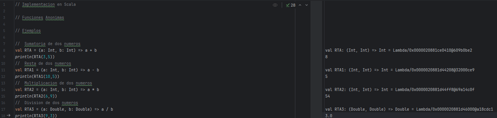
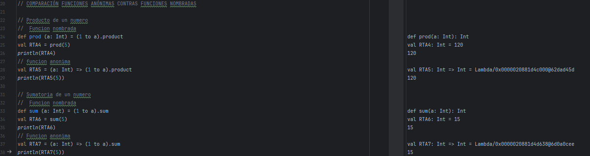

# Funciones Anónimas

Las funciones anónimas o también llamadas, en algunos lenguajes, como funciones lambdas. Se definen sin un nombre, especialmente útiles para la reducción de código y cálculos simples. Las podemos encontrar en leguajes que soporten el paradigma de programación funcional como son **SCALA, PYTHON, JAVA y JAVASCRIPT**.

## COMO ESCRIBIRLAS - SINTAXIS
Para la sintaxis en el lenguaje **SCALA** se escriben de la siguiente manera
**(parámetros) => operación** 

> [!NOTE]
> => nos hace referencia de que trata de una función <br />
"parámetros" Lo que enviamos a una función común, ya sea uno o mas enteros, una cadena, etc <br />
"operación" Lo que va a hacer u devolver la función.

## CARACTERÍSTICAS

- No llevan un nombre al momento escribirlas.
- De un solo uso.
- Reducción de código a una línea.

## EJEMPLOS
Se utilizara el lenguaje **SCALA** para los ejemplos

### Suma de dos números
```Scala
val RTA = (a: Int, b: Int) => a + b
```

> [!NOTE]
> Declaramos la variable "val RTA" ponemos el igual "=" y seguimos la sintaxis menciona anteriormente <br /> (a: Int, b: Int) = parámetros <br /> "a + b" = operación 

### Resta de dos números
```Scala
val RTA = (a: Int, b: Int) => a - b
```
>[!NOTE]
> (a: Int, b: Int) = parámetros <br />
"a - b" = operación

### Multiplicación de dos números
```Scala
val RTA = (a: Int, b: Int) => a * b
```
> [!NOTE]
> (a: Int, b: Int) = parámetros <br />
"a * b" = operación

### División de dos números
```Scala
val RTA = (a: Double, b: Double) => a / b
```
> [!NOTE]
> (a: Double, b: Double) = parámetros <br />
"a / b" = operación

## VENATAJAS

- Sintaxis compacta.
- Código mas limpio y legible.
- Uso de programación funcional.

## DESVENTAJAS

- No da puerta a la reutilización.
- Difíciles de encontrar el error en operaciones largas.

## COMPARACIÓN FUNCIONES ANÓNIMAS CONTRAS FUNCIONES NOMBRADAS
Se utilizara el lenguaje **SCALA** para la comparación entre los dos tipos de funciones

### Producto de un número
**Función nombrada**
```Scala
def Prod (a: Int) = (1 to a).producto
```
**Función anónima**
```Scala
al RTA = (a: Int) => (1 to a).producto
```
### Sumatoria de un número
**Función nombrada**
```Scala
def Sum (a: Int) = (1 to a).sum
```
**Función anónima**
```Scala
val RTA = (a: Int) => (1 to a).sum
```

## Imágenes del código en Intellij IDEA
 

  